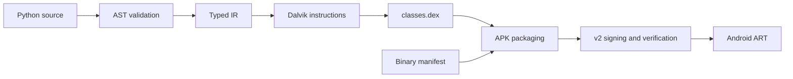

<div align="center">

# 🐍 Anpyra · Python to Native Android

**Write a small Android app in Python. Compile directly to DEX. Build a signed APK.**

[](https://pypi.org/project/anpyra/)
[](docs/user_guide/installation.md)
[](LICENSE)
[](docs/roadmap.md)
[](https://github.com/babar-xagi/Anpyra/actions/workflows/tests.yml)

[📖 User Guide](docs/user_guide/README.md) · [🛠️ Developer Guide](docs/developer_guide/README.md) · [🗺️ Roadmap](docs/roadmap.md) · [🤝 Contribute](CONTRIBUTING.md)

</div>

## ✨ What is Anpyra?

Anpyra is a Python-written compiler and build framework for a **small, typed Python subset**. It translates source into native Android bytecode, packages a binary manifest and DEX file, and signs the APK.

It grew from the successful **PyAndroid experiments 001–008**. Experiment 008 supplies the cumulative compiler foundation; Anpyra adds an installable package, build API, project configuration, CLI, examples, and automated checks.

**Current status: v0.1 alpha.** Small `Activity` + `TextView` apps, typed values, conditions, arithmetic, and integer helpers work within documented limits. The current source additionally supports native Screen backgrounds/images/gradients; these are unreleased APIs. Layouts, buttons, callbacks, general Python libraries, and release/store workflows are future phases.

**Current focus: Android only.** The source cleanup removes common/platform layers and future-target placeholders, and separates native Android components. Public application imports remain compatible. See [components](docs/developer_guide/android_components.md) and [implementation progress](docs/progress.md). The cleanup is unreleased; PyPI 0.1.0 remains the published package.

## ⚙️ How it works



**🐍 Python-based Android builds:** no Java/JDK, Kotlin, Android SDK build kit, Android NDK, or Android Studio required. Anpyra generates DEX, binary XML and APKs with Python and signs them using `cryptography`; Pillow validates/normalizes screen colors and image assets. Dependencies are installed automatically. Gradle, D8, R8, AAPT2 and apksigner are also unnecessary.

Application source is parsed on the host; Android executes the generated bytecode. Optional `adb` from platform-tools provides device installation. SDK levels in configuration are manifest compatibility metadata. These requirements apply to the current Android backend.

## 🚀 Quick start

**Anpyra 0.1.0 is available on [PyPI](https://pypi.org/project/anpyra/0.1.0/).** uv is recommended; pip is also supported. Install uv using [its official instructions](https://docs.astral.sh/uv/getting-started/installation/), then create an environment and install the package.

```powershell
uv venv --python 3.12
uv pip install anpyra
.\.venv\Scripts\python.exe -m anpyra doctor
```

On Linux/macOS, use `.venv/bin/python -m anpyra doctor`. If `.venv` already exists, skip environment creation. These commands need no activation. See [installation](docs/user_guide/installation.md) for uv setup, source checkout installation, pip alternatives and local wheels.

Prefer pip? On Windows:

```powershell
python -m venv .venv
.\.venv\Scripts\python.exe -m pip install anpyra
.\.venv\Scripts\python.exe -m anpyra doctor
```

Activate with `.\.venv\Scripts\Activate.ps1` on Windows or `source .venv/bin/activate` on Linux/macOS to use the shorter commands below. You can always use the environment's Python with `-m anpyra` instead.

```powershell
anpyra init myapp --package dev.example.myapp --label "My App"
anpyra check myapp
anpyra build myapp
anpyra verify myapp/build/dev.example.myapp.apk
# With adb and a connected, authorized device:
anpyra install myapp/build/dev.example.myapp.apk --launch
```

## 🧩 Your first app

```python
from anpyra import Activity, TextView


class MainActivity(Activity):
    def on_create(self, state):
        title = TextView(self)
        title.set_text("Hello from Anpyra!")
        self.set_content_view(title)
```

Build through Anpyra and run the APK on Android. The authoring types help editors understand the API; they do not provide a host-side UI preview.

## 📦 What works today?

| Area | Implemented in v0.1 |
| --- | --- |
| Native UI | Activity/TextView; unreleased Screen styles, one content child and text color |
| Types | Initialized `str`, `int`, `bool` locals |
| Expressions | Simple integer `+` / `-`, signed 16-bit literals |
| Control flow | Boolean conditions, integer comparisons, nested `if` / `elif` / `else` |
| Functions | Top-level integer helpers with 0–5 parameters and one return expression |
| Tooling | `init`, `check`, `build`, `verify`, `doctor`, `targets`, optional `install` |
| Output | DEX, binary manifest, unsigned/signed APK, optional validated PNG assets, JSON report |
| Compatibility | `pyandroid` imports from source experiments 005–008 |

`on_create` has a 14-symbol budget for source locals/temporaries; styled screens have separate rendering scratch/argument registers. Reassignment, loops, collections, events, arbitrary imports, and multi-module apps are not implemented. Consult the [language reference](docs/user_guide/language.md).

## 🗂️ Repository at a glance

```text
Anpyra/
├── src/anpyra/
│   ├── api.py, config.py, scaffold.py, cli.py, build.py
│   ├── components/        # Screen, Image, Gradient and Background API
│   ├── compiler/          # Front end, IR and declarative style parsing
│   └── android/
│       ├── screen.py      # Native view calls
│       ├── backgrounds.py # Drawable/image/gradient emission
│       ├── assets.py      # Validated image conversion and asset mapping
│       ├── codegen.py     # IR → method code and registers
│       ├── dalvik.py      # Instruction encoding and assembler
│       ├── dex.py         # DEX tables, sections and checksums
│       ├── dex_types.py, encoding.py
│       ├── manifest.py, manifest_inspect.py
│       ├── packaging.py, signing.py, verify.py
│       └── README.md
├── src/pyandroid/         # Experiment import compatibility
├── examples/              # Hello and score Android apps
├── tests/                 # Unit, integration, regression and fixtures
├── docs/
│   ├── user_guide/
│   ├── developer_guide/
│   ├── progress.md        # Implemented work and actual success evidence
│   └── roadmap.md         # Android completion phases
├── scripts/               # Documentation/release checks
└── .github/               # Tests, publishing and contribution templates
```

Generated output, environments, caches, and `.anpyra/` signing state are local artifacts excluded from Git. See the [detailed structure](docs/developer_guide/repository_structure.md).

Run `anpyra targets` to see the supported Android target. Build/check default to Android. Component files contain their actual implementation, with one canonical DEX writer in android/dex.py.

## 📚 Find your guide

| Your goal | Start here |
| --- | --- |
| Install and build an app | [User guide](docs/user_guide/README.md) |
| Understand supported syntax | [Language and examples](docs/user_guide/language.md) |
| Style screen colors, images and gradients | [Screen component guide](docs/user_guide/screen.md) |
| Find the file responsible for a bug | [Source reference](docs/developer_guide/source_reference.md) |
| Trace a compiler or signing problem | [Debugging guide](docs/developer_guide/debugging.md) |
| Implement a new feature | [Extension guide](docs/developer_guide/extending.md) |
| See implementation and actual results | [Progress record](docs/progress.md) |
| See completed and future work | [Roadmap and phases](docs/roadmap.md) |
| Publish the framework wheel | [PyPI setup and release commands](docs/developer_guide/publishing.md) |

## 🧪 Verification and contribution

For development, clone the repository and use its editable installation before running these checks.

```powershell
# In the activated environment (pip alternative: python -m pip install -e ".[dev]")
uv pip install -e ".[dev]"
python -m unittest discover -s tests -v
ruff check src tests examples scripts
ruff format --check src tests examples scripts
python scripts/check_docs.py
```

The existing suite contains **76 tests** covering compiler behavior, binary instructions, configuration, CLI workflows, signer reuse, tamper detection, and reproducible rebuilds. The v0.1 baseline also passed a wheel installation/build check and builds both examples. CI is configured for Windows/Linux and Python 3.11/3.13; the badge reports remote status.

The author confirmed successful phone installation of the published starter APK on October 6, 2026. Exact screen text, score branches, lifecycle behavior and independent verification still require recorded acceptance. The current cleanup also preserves existing example APK and experiment DEX bytes. Use the [device checklist](docs/developer_guide/testing.md) when validating a release.

Contributions start with [CONTRIBUTING.md](CONTRIBUTING.md). Anpyra uses the [Apache-2.0 license](LICENSE).
