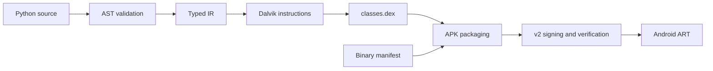

<div align="center">

# 🐍 Anpyra · Python to Native Android

**Write a small Android app in Python. Compile directly to DEX. Build a signed APK.**

[](CHANGELOG.md)
[](docs/user_guide/installation.md)
[](LICENSE)
[](docs/roadmap.md)
[](https://github.com/babar-xagi/Anpyra/actions/workflows/tests.yml)

[📖 User Guide](docs/user_guide/README.md) · [🛠️ Developer Guide](docs/developer_guide/README.md) · [🗺️ Roadmap](docs/roadmap.md) · [🤝 Contribute](CONTRIBUTING.md)

</div>

## ✨ What is Anpyra?

Anpyra is a Python-written compiler and build framework for a **small, typed Python subset**. It translates source into native Android bytecode, packages a binary manifest and DEX file, and signs the APK.

It grew from the successful **PyAndroid experiments 001–008**. Experiment 008 supplies the cumulative compiler foundation; Anpyra adds an installable package, build API, project configuration, CLI, examples, and automated checks.

**Current status: v0.1 alpha.** Small `Activity` + `TextView` apps, typed values, conditions, arithmetic, and integer helpers work within documented limits. Layouts, buttons, callbacks, general Python libraries, and release/store workflows are future phases.

## ⚙️ How it works



Application source is parsed on the host. Android executes the generated bytecode. The build uses Python and `cryptography`; it does not require Gradle, Java, Kotlin, D8, R8, AAPT2, or apksigner. Optional `adb` provides device installation.

## 🚀 Quick start

Clone the repository, then install from source. The published-package workflow is not available yet.

```powershell
git clone https://github.com/babar-xagi/Anpyra.git
cd Anpyra
python -m venv .venv
.\.venv\Scripts\Activate.ps1
python -m pip install -e .
anpyra doctor
anpyra build examples/hello
```

On Linux/macOS, activate with `source .venv/bin/activate`. If PowerShell activation is unavailable, use `.\.venv\Scripts\python.exe -m anpyra` directly. See [installation](docs/user_guide/installation.md) for complete steps.

```powershell
anpyra init myapp --package dev.example.myapp --label "My App"
anpyra check myapp
anpyra build myapp
anpyra verify myapp/build/dev.example.myapp.apk
# With adb and a connected, authorized device:
anpyra install myapp/build/dev.example.myapp.apk --launch
```

## 🧩 Your first app

```python
from anpyra import Activity, TextView


class MainActivity(Activity):
    def on_create(self, state):
        title = TextView(self)
        title.set_text("Hello from Anpyra!")
        self.set_content_view(title)
```

Build through Anpyra and run the APK on Android. The authoring types help editors understand the API; they do not provide a host-side UI preview.

## 📦 What works today?

| Area | Implemented in v0.1 |
| --- | --- |
| Native UI | One `Activity`, `TextView`, text and content-view calls |
| Types | Initialized `str`, `int`, `bool` locals |
| Expressions | Simple integer `+` / `-`, signed 16-bit literals |
| Control flow | Boolean conditions, integer comparisons, nested `if` / `elif` / `else` |
| Functions | Top-level integer helpers with 0–5 parameters and one return expression |
| Tooling | `init`, `check`, `build`, `verify`, `doctor`, optional `install` |
| Output | DEX, binary manifest, unsigned/signed APK, JSON build report |
| Compatibility | `pyandroid` imports from source experiments 005–008 |

`on_create` has a 14-register budget for locals and temporary values. Reassignment, loops, collections, events, arbitrary imports, and multi-module apps are not implemented. Consult the [language reference](docs/user_guide/language.md).

## 🗂️ Repository at a glance

```text
Anpyra/
├── src/                    # Framework and compatibility API
│   ├── anpyra/
│   │   ├── compiler/       # AST, typed IR, Dalvik and DEX
│   │   └── android/        # Manifest, signing and verification
│   └── pyandroid/          # Legacy authoring imports
├── examples/               # Complete hello and score projects
├── tests/
│   ├── unit/               # Compiler, configuration and DEX checks
│   ├── integration/        # Project builds, CLI and signing
│   ├── regression/         # Experiment 008 tests
│   └── fixtures/           # Source apps from experiments 005–008
├── docs/
│   ├── user_guide/         # Install, learn, build, troubleshoot
│   ├── developer_guide/   # File map, internals, debug, extend
│   └── roadmap.md          # Completed work and future phases
├── scripts/                # Maintenance checks
└── .github/                # CI and contribution templates
```

Generated output, environments, caches, and `.anpyra/` signing state are local artifacts excluded from Git. See the [detailed structure](docs/developer_guide/repository_structure.md).

## 📚 Find your guide

| Your goal | Start here |
| --- | --- |
| Install and build an app | [User guide](docs/user_guide/README.md) |
| Understand supported syntax | [Language and examples](docs/user_guide/language.md) |
| Find the file responsible for a bug | [Source reference](docs/developer_guide/source_reference.md) |
| Trace a compiler or signing problem | [Debugging guide](docs/developer_guide/debugging.md) |
| Implement a new feature | [Extension guide](docs/developer_guide/extending.md) |
| See completed and future work | [Roadmap and phases](docs/roadmap.md) |

## 🧪 Verification and contribution

```powershell
python -m pip install -e ".[dev]"
python -m unittest discover -s tests -v
ruff check src tests examples scripts
ruff format --check src tests examples scripts
python scripts/check_docs.py
```

The existing suite contains **41 tests** covering compiler behavior, binary instructions, configuration, CLI workflows, signer reuse, tamper detection, and reproducible rebuilds. The v0.1 baseline also passed a wheel installation/build check and builds both examples. CI is configured for Windows/Linux and Python 3.11/3.13; the badge reports remote status.

The original experiments were reported successful on a phone. **Framework-level device acceptance is still pending**; host verification does not establish runtime acceptance. Use the [device checklist](docs/developer_guide/testing.md) when validating a release.

Contributions start with [CONTRIBUTING.md](CONTRIBUTING.md). Anpyra uses the [Apache-2.0 license](LICENSE).
