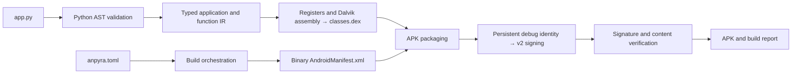

# Architecture

The experiments established a working compiler; Anpyra adds a reusable application contract, public build API, validated project metadata, and a single command-line workflow. Experiment 008 supplies the latest cumulative engine, rather than eight separate compiler versions being maintained.

## Modules

| Module | Responsibility |
| --- | --- |
| `anpyra.api` | `Activity` and `TextView` authoring types |
| `anpyra.config` | Immutable metadata, validation, project-relative paths |
| `anpyra.compiler.frontend` | Parse source, validate supported syntax and types, lower to IR |
| `anpyra.compiler.ir` | Immutable application, function, and operation records |
| `anpyra.compiler.dex` | Register assignment, instruction assembly, labels, DEX tables and checksums |
| `anpyra.android.manifest` | Binary Android XML string pool and manifest generation |
| `anpyra.android.manifest_inspect` | Decode manifest metadata for build verification |
| `anpyra.android.signing` | Persistent debug RSA identity, chunked APK digests, v2 signing block |
| `anpyra.android.verify` | Verify the framework's single-signer/two-entry APK profile |
| `anpyra.build` | In-memory payload construction, staged verification, artifact output |
| `anpyra.scaffold` | Create a buildable application project |
| `anpyra.cli` | User-facing commands and optional adb installation |
| `pyandroid` | Legacy authoring imports for experiments 005–008 |

The public package exports authoring classes, configuration records, build functions, compile functions, and user-facing errors. Backend modules are internal and may evolve during the alpha series.

## Contracts

Compilation is static: no `exec`, import of the application, or evaluation of its statements. A Python AST that parses successfully may still be rejected because the accepted language is intentionally small. Unsupported module statements, imports, aliases, extra classes/methods, and decorators cannot be silently discarded.

`AppIR` contains metadata, top-level helper methods, `on_create` operations, and symbol types. Helpers become static methods on the generated Activity. Parameters occupy the high registers in their method frame; a value-returning static invoke is immediately followed by `move-result`.

The current allocator assigns one register per local/temporary and reserves two incoming registers for `self` and `state`. Its maximum of 16 registers keeps invoked arguments and comparisons inside the existing instruction formats. Register reuse, lifetime analysis, and wider instruction formats are planned extensions, not existing capabilities.

The APK contains `AndroidManifest.xml` and `classes.dex`. Verification checks its single-signer v2 structure, certificate/public-key consistency, RSA signature, protected content digest, DEX magic, SHA-1, and Adler-32. It is intended for Anpyra artifacts rather than as a general APK auditing tool. DEX checksums and the targeted binary tests do not replace Android's verifier or a real-device test.

Build output is staged and verified before publishing local artifact files. Source validation occurs before signing-state creation. A project retains one debug identity across builds. CI never depends on a shared private key.

## Experiment lineage

| Experiment | Contribution retained |
| --- | --- |
| 001 | DEX container tables, strings, checksums |
| 002 | Constructors, method code, Activity lifecycle |
| 003 | Native TextView construction and UI calls |
| 004C | Binary manifest, APK packaging, v2 signing and verification |
| 005 | Python source front end and IR |
| 006 | Type checking, symbols, boolean branches |
| 007 | Integer arithmetic/comparisons and nested branches |
| 008 | Typed helpers, parameters, static calls, and returns |

The preserved source fixtures cover the source-app milestones 005–008. Historical archives remain outside the distributed framework, and archived signing material was excluded from the import.

## Extending the framework

Add a feature across the relevant stages: define its semantics, validate/lower its AST form, add explicit IR, generate the required DEX references and instructions, and test resulting bytes and Android behavior. New widgets also need authoring API types and Android method/type mappings. Resource-based features need a resource model and packaging changes; adding Python methods to the authoring classes alone does not implement Android behavior.

Use the primary [DEX format](https://source.android.com/docs/core/runtime/dex-format), [Dalvik constraints](https://source.android.com/docs/core/runtime/constraints), and [APK v2 signing](https://source.android.com/docs/security/features/apksigning/v2) specifications when extending the binary formats.
