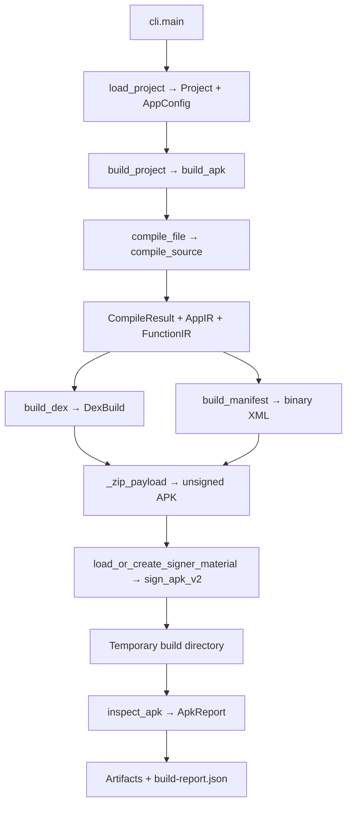

# ⚙️ Architecture and Data Flow

Anpyra has three main responsibilities: validate application source, emit native Android artifacts, and coordinate a reproducible project build. Source compilation never imports or evaluates the app.

## 🔄 End-to-end build

`check` stops after in-memory DEX generation. `verify` inspects an existing APK. `install` verifies first, then invokes optional adb. Each path is visible in `cli.main`.

## 🧱 Main records

| Record | Produced by | Consumer/purpose |
| --- | --- | --- |
| `AppConfig` | Defaults/TOML/direct API | Validated package, labels, versions, SDKs and project path settings |
| `Project` | Config loader or caller | Resolved entry/output/state paths |
| `CompileResult` | Front end | Source path, Python AST, typed AppIR |
| `AppIR` | Front end | Class/package/label, helper IR, lifecycle operations, symbol types |
| `FunctionIR` | HelperCompiler | Helper signature, operations and symbols |
| `DexBuild` | DEX backend | File bytes, method listings, register map and lifecycle code-unit count |
| `V2SignerMaterial` | Signer loader/generator | RSA key, certificate DER and public-key DER |
| `V2SignResult` | Signing | Signed APK, digest, block size and offsets |
| `ApkReport` | Verification | Parsed manifest and integrity results |
| `BuildResult` | Build orchestration | Written artifact paths, compiler/backend/report data |

Most records are frozen dataclasses. They carry explicit values between stages rather than requiring the stages to read project files independently.

## 🔌 Boundaries

`api.py` provides editor-facing classes; `frontend.py` recognizes their names and builds IR; `dex.py` emits corresponding Android references and instructions. Adding an authoring method without front-end and backend support does not implement that feature.

Manifest generation needs metadata but not the source AST. Packaging needs bytes. Signing needs the unsigned ZIP and identity. Verification reads the resulting APK separately, although its binary implementation shares digest and manifest definitions with the writer; that shared implementation is one reason independent verification is still a roadmap item.

The public package root exposes authoring/configuration/compile/build interfaces. Compiler/Android internals can change during alpha development. `pyandroid` re-exports the same authoring classes for historical source imports.

## 🛡️ Important invariants

- Unsupported source should fail clearly rather than be silently executed or treated as implemented.
- Helpers become static methods, with incoming parameters in the high registers of their frame.
- `move-result` immediately follows a value-returning helper invoke.
- Branch labels resolve in 16-bit code units; DEX file offsets are bytes.
- The one unconditional content-view attachment is enforced by the front end.
- Rebuilds retain the debug identity; incomplete/mismatched pairs fail.
- Staged APK verification precedes output replacement. Individual files are atomic replacements, not a transaction for the full directory.

## 🧬 Experiment lineage

| Milestone | Retained contribution | Current location |
| --- | --- | --- |
| 001 | DEX container/tables/strings/checksums | `compiler/dex.py` |
| 002 | Constructors and lifecycle bytecode | `compiler/dex.py` |
| 003 | Native TextView calls | `api.py`, front end, DEX backend |
| 004C | Binary manifest, APK and v2 signing | `android/`, `build.py` |
| 005 | Static Python front end and IR | `compiler/frontend.py`, `ir.py` |
| 006 | Symbols, types, boolean branches | Front end, IR, assembler |
| 007 | Arithmetic, integer comparisons, nested branches | Front end, IR, assembler |
| 008 | Typed helpers, parameters, static calls, results | Front end, FunctionIR, DEX method generation |

The author reported these experiments successful on a device. The framework baseline passed host tests/build/wheel checks; its separate phone acceptance remains pending. This distinction is recorded in the [roadmap](../roadmap.md).
