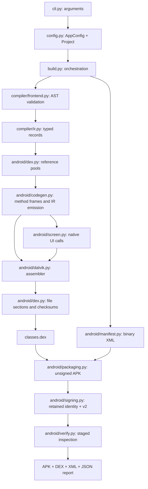

# ⚙️ Architecture and Data Flow

Anpyra is an Android-only static compiler/build pipeline. Source is parsed and validated, never imported or executed on the build computer. Each native artifact component has a canonical implementation.

## 🔄 Build flow

Check runs front-end/DEX generation in memory. Verify inspects an existing APK. Install verifies first, then invokes optional adb. targets reports Android only; no platform registry remains.

## 🧱 Data records

AppConfig/Project carry metadata and resolved paths. CompileResult carries source/AST/AppIR; AppIR/FunctionIR carry operations/symbols. MethodKey/ProtoKey identify references. GeneratedMethods carries constructed method code/listings. DexBuild contains the DEX bytes and inspection listings. V2SignerMaterial/V2SignResult carry identity/signing state and result. ApkReport contains successful parsed metadata/integrity results. BuildResult contains published paths and all build stage reports.

Frozen records make stage inputs/results explicit. See [source reference](source_reference.md) for fields/functions.

## 🔌 Component boundaries

Screen bindings own native UI descriptors/method references and UI operation emission. Code generation owns scalar/helper/control flow and register frames. Dalvik owns instruction formats/labels. DEX owns reference indexing, file sections and checksums. Encoding owns binary/string primitives. Packaging owns deterministic ZIP entries. Build orchestration joins these stages, without duplicating their logic.

API stubs provide editor signatures only. Adding a stub without front-end/IR/emitter support does not add a feature. Manifest writing uses metadata rather than AST; signing uses archive bytes and retained identity; verification reads the generated profile but shares some writer assumptions. Independent inspection is still needed.

## 🛡️ Preserved invariants

- Unsupported source fails; app code is never executed on the host.
- Lifecycle requires one unconditional content-view attachment.
- Helpers use high incoming registers; move-result immediately follows a result-producing invoke.
- Branch positions are code units; DEX offsets are bytes.
- Existing signing identities are retained; incomplete/mismatched pairs fail.
- Compilation happens before signer creation; staged verification precedes output replacement.
- Individual artifact replacements are atomic, not one multi-file transaction.

The cleanup preserves exact experiment DEX bytes/listings and signed example APK bytes. Public application imports remain; duplicate forwarding modules have been removed. Historical common/platform internal paths are removed by the Android-only scope decision.

See [progress](../progress.md) for installation/publication evidence and [roadmap](../roadmap.md) for Android completion work.
