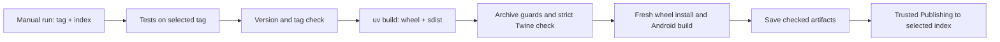

# 📦 Publish Anpyra to TestPyPI and PyPI

This guide covers publishing the **Python framework package**: wheel (`.whl`) plus source distribution (`.tar.gz`). Android APK/store distribution is a separate workflow. A PyPI account is a starting point; you must also connect this GitHub repository as a trusted publisher.

Anpyra 0.1.0 was published to PyPI on October 6, 2026 through [the successful publishing run](https://github.com/babar-xagi/Anpyra/actions/runs/37472908394). The public wheel/source archive and fresh package installation were verified. TestPyPI rehearsal was not run for this release. No upload is performed by ordinary Git pushes or tags. The [publish workflow](../../.github/workflows/publish.yml) runs only when you explicitly dispatch it from `main`.

## 🗂️ Release files

| File | Purpose |
| --- | --- |
| [publish.yml](../../.github/workflows/publish.yml) | Manual TestPyPI/PyPI release pipeline |
| [tests.yml](../../.github/workflows/tests.yml) | Reused Windows/Linux, Python 3.11/3.13 validation for the selected tag |
| [check_release.py](../../scripts/check_release.py) | Read-only version/tag and distribution guards |
| [pyproject.toml](../../pyproject.toml) | Package identity/version, classifiers, dependencies and project links |
| [PyPI README](../pypi_readme.md) | Package landing page with absolute documentation links and supported Markdown |
| [MANIFEST.in](../../MANIFEST.in) | Source-distribution file inclusion |

## 🔄 What the pipeline does



Only the final publish job receives `id-token: write`; it downloads the checked artifacts and uses PyPA's publisher action. It does not check out or rebuild source. GitHub/PyPI exchange a short-lived OIDC credential, so this workflow needs no stored PyPI API token. See [PyPI Trusted Publishing](https://docs.pypi.org/trusted-publishers/using-a-publisher/).

## 1️⃣ One-time account and environment setup

Sign into [PyPI](https://pypi.org/) using your account. For rehearsal, create a separate [TestPyPI account](https://test.pypi.org/); the two services have separate accounts and settings. Complete their account requirements, including two-factor authentication where required.

In GitHub, open `babar-xagi/Anpyra` → **Settings → Environments** and create:

| Environment | Used by |
| --- | --- |
| `testpypi` | TestPyPI publishing runs |
| `pypi` | Production PyPI publishing runs |

Allow deployments from `main`, because the workflow is dispatched from `main` and then checks out the specified tag. Environment names must match the publisher configuration exactly. You may add required reviewers where your repository plan supports them; if configured, approve the waiting deployment before its upload starts. See [GitHub environment rules](https://docs.github.com/en/actions/reference/workflows-and-actions/deployments-and-environments).

## 2️⃣ Connect each index to GitHub

For a **new project**, open [PyPI account publishing](https://pypi.org/manage/account/publishing/) and add a pending GitHub publisher. Configure TestPyPI separately through [TestPyPI account publishing](https://test.pypi.org/manage/account/publishing/).

| Publisher field | PyPI | TestPyPI |
| --- | --- | --- |
| PyPI project name | `anpyra` | `anpyra` |
| Owner | `babar-xagi` | `babar-xagi` |
| Repository name | `Anpyra` | `Anpyra` |
| Workflow filename | `publish.yml` | `publish.yml` |
| Environment name | `pypi` | `testpypi` |

Use the workflow filename alone, not `.github/workflows/publish.yml`. Your PyPI username does not need to equal the GitHub owner name.

For an **existing project you own**, open its Manage → Publishing page and add the same GitHub publisher. See [existing project setup](https://docs.pypi.org/trusted-publishers/adding-a-publisher/) and [new project setup](https://docs.pypi.org/trusted-publishers/creating-a-project-through-oidc/).

A pending publisher does not reserve a name. PyPI determines availability when you publish. If `anpyra` belongs to another account, use a distribution name you own and update `project.name` plus the publisher/project commands together. The Python import package can remain `anpyra`. The production anpyra project now exists under this account. For a different project/name, verify its ownership separately.

## 3️⃣ Prepare and push a release candidate

Current release version: **0.1.1**. Commands below use this version; for subsequent releases choose a new version and tag rather than rerunning a completed upload. Keep these two values identical:

- `pyproject.toml` → `[project] version`.
- `src/anpyra/__init__.py` → `__version__`.

Update the changelog and retain the alpha/runtime limits. Each index rejects replacement of previously uploaded release files; choose a new version for a changed release. Do not delete/reuse a published version. Refer to the [release checklist](release.md).

From the checkout on Windows:

```powershell
uv pip install -e ".[dev]"
.\.venv\Scripts\python.exe scripts/check_release.py --tag v0.1.1
.\.venv\Scripts\python.exe scripts/check_docs.py
.\.venv\Scripts\python.exe -m unittest discover -s tests -v
.\.venv\Scripts\ruff.exe check src tests examples scripts
.\.venv\Scripts\ruff.exe format --check src tests examples scripts
git diff --check
```

First commit and push the publishing files to `main`. Every new commit starts with an emoji:

```powershell
git add .github/workflows/publish.yml .github/workflows/tests.yml scripts/check_release.py tests/unit/test_release.py pyproject.toml src/anpyra/__init__.py docs README.md CHANGELOG.md scripts/README.md tests/README.md
git commit -m "📦 Prepare Anpyra 0.1.1 and document installation upgrades"
git push origin main
git tag -a v0.1.1 -m "📦 Anpyra 0.1.1 alpha"
git push origin v0.1.1
```

Replace `0.1.1` in commands with your chosen version. Create the tag after the candidate's code, workflow and docs are committed. If that tag already exists, inspect its commit rather than replacing it. Tag pushes run normal CI; they do not upload to a package index.

## 4️⃣ Rehearse on TestPyPI

In GitHub open **Actions → Publish Python package → Run workflow**:

1. Choose branch `main`.
2. Enter existing tag `v0.1.1`.
3. Select repository `testpypi`.
4. Start the run, follow validation/build and approve an environment deployment only if your configured rules require it.

Optional GitHub CLI commands, after installing/authenticating `gh`:

```powershell
gh auth login
gh workflow run publish.yml --repo babar-xagi/Anpyra --ref main -f tag=v0.1.1 -f repository=testpypi
gh run list --repo babar-xagi/Anpyra --workflow publish.yml
gh run watch RUN_ID --repo babar-xagi/Anpyra
```

`RUN_ID` is the numeric ID shown by `gh run list`. Success should create [the TestPyPI project page](https://test.pypi.org/project/anpyra/). The run's artifact contains the checked wheel and source archive.

### 🧪 Test installation from the index

Create a fresh environment outside the checkout. Install dependencies from normal PyPI, then only Anpyra from TestPyPI:

```powershell
uv venv --python 3.12 verify-testpypi
uv pip install --python verify-testpypi/Scripts/python.exe "cryptography>=46.0.0" "Pillow>=11.3.0"
uv pip install --python verify-testpypi/Scripts/python.exe --index-url https://test.pypi.org/simple/ --no-deps "anpyra==0.1.1"
.\verify-testpypi\Scripts\anpyra.exe --version
.\verify-testpypi\Scripts\anpyra.exe init test-app
.\verify-testpypi\Scripts\anpyra.exe build test-app
.\verify-testpypi\Scripts\anpyra.exe verify test-app/build/dev.anpyra.app.apk
```

TestPyPI may not carry all dependencies; this keeps dependency resolution on the normal index. On Linux/macOS replace `Scripts/python.exe` with `bin/python` and invoke `bin/anpyra`.

## 5️⃣ Publish to production PyPI

After reviewing the TestPyPI result, run the same workflow from `main`, with the same tag and repository `pypi`:

```powershell
gh workflow run publish.yml --repo babar-xagi/Anpyra --ref main -f tag=v0.1.1 -f repository=pypi
gh run list --repo babar-xagi/Anpyra --workflow publish.yml
gh run watch RUN_ID --repo babar-xagi/Anpyra
```

You can use GitHub's Run workflow UI instead. Each run builds/checks distributions from the selected tag; TestPyPI and PyPI runs are separate builds. Production publication is an explicit choice, not automatic promotion.

Verify [the production project page](https://pypi.org/project/anpyra/) and install outside the checkout:

```powershell
uv venv --python 3.12 verify-pypi
uv pip install --python verify-pypi/Scripts/python.exe "anpyra==0.1.1"
.\verify-pypi\Scripts\anpyra.exe --version
```

Users can then install that published version with `uv pip install anpyra` or `python -m pip install anpyra` in their own environment. The installation guide includes exact 0.1.1 and latest-version upgrade commands. Record public-index verification after each release. Publishing the framework does not establish Android app-store readiness.

## 🧰 Local build and package checks

Use a new or empty version-specific output folder so old packages cannot be mixed into an upload:

```powershell
uv build --no-create-gitignore --out-dir dist/pypi/0.1.1
.\.venv\Scripts\python.exe scripts/check_release.py --tag v0.1.1 --dist dist/pypi/0.1.1
uvx --from twine twine check --strict dist/pypi/0.1.1/*
```

`--no-create-gitignore` prevents uv from adding a housekeeping file to the release directory. The guard requires one wheel and one sdist, matching name/version metadata, the typing marker and required release source files. It rejects duplicate/unsafe paths, source links and common private/generated file names. This is a package-profile check, not a general secret scanner. It never uploads, extracts archives or reads credentials.

The pip alternative, inside an activated Python-created environment:

```powershell
python -m pip install build twine
python -m build --outdir dist/pypi/0.1.1
python scripts/check_release.py --tag v0.1.1 --dist dist/pypi/0.1.1
python -m twine check --strict dist/pypi/0.1.1/*
```

## 🐛 Common release failures

| Failure | What to check |
| --- | --- |
| All jobs skipped | Dispatch branch must be `main` |
| Tag checkout fails | Tag must already exist on GitHub; push it first |
| Version/tag mismatch | Match source metadata, package version and `vVERSION` |
| Stale release directory | Use an empty output folder containing exactly two distributions |
| Twine description check fails | Fix `docs/pypi_readme.md` and rebuild |
| Trusted publisher rejected | Match owner, repo, `publish.yml`, environment and correct index |
| Name/ownership conflict | Use a distribution name you own; pending registration does not reserve it |
| File already exists | Do not replace a release; bump source versions and create a new tag |
| TestPyPI dependency missing | Install dependencies from normal PyPI, then TestPyPI Anpyra with `--no-deps` |

For publisher-specific errors, use [PyPI troubleshooting](https://docs.pypi.org/trusted-publishers/troubleshooting/).
